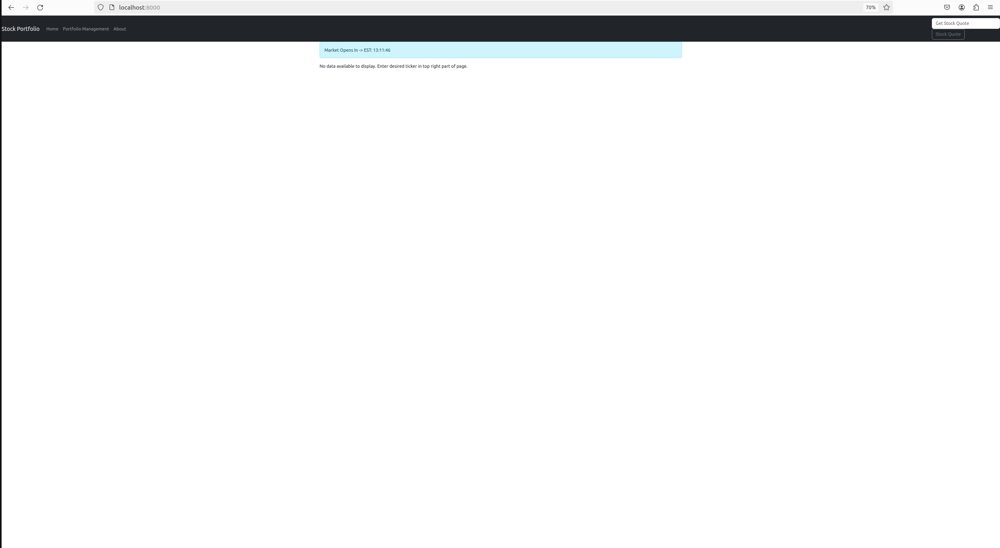
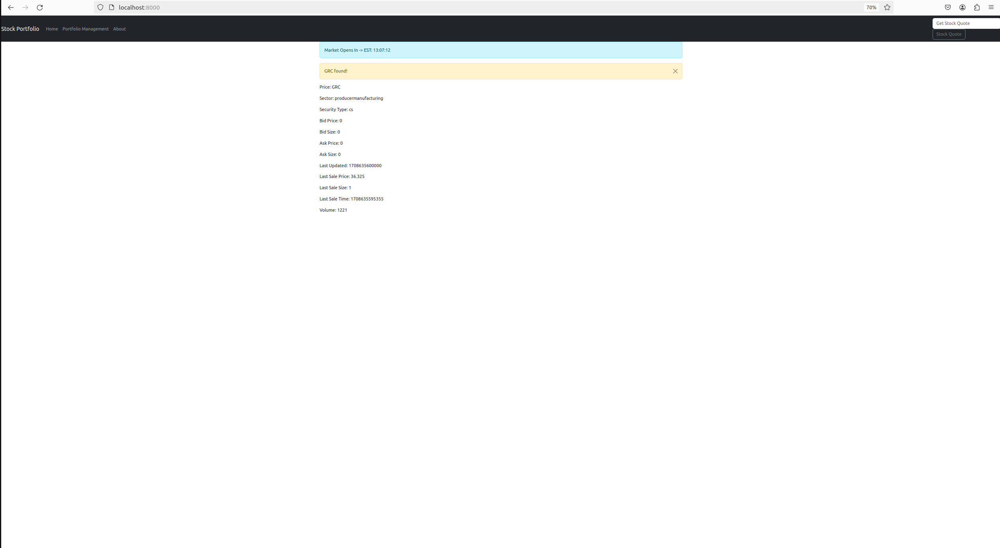

# Introduction

In the dynamic intersection of technology and finance, there's an increasing demand for tools that simplify investment tracking for end users. My project, a stock/commodity/item price tracking application is designed to meet this rudimentary requirement. Central to this project is the creation of an end-to-end, database-driven website using Django, with dependency management support of conda, the portability/isolation of the docker containerization strategy and the entire development lifecycle managed and automated through AWS CodePipeline.

Although simple in its conception, the need for a tracking application is just one foundational step in financial literacy serving as a potential foothold into taking a more proactive approach to portfolio monitoring and management. Having never programmed an end-to-end application before I want to flush out this subject and implement the application using Development Operations (DevOps) techniques I learned at my job and the applications I have not had a chance to use but have learned.

# Project Overview

The primary goal of this stock market portfolio is to offer a comprehensive, widely available application capable of executing create, read, update and delete (CRUD) operations through a REST API, with a focus on persistent data storage. This application is tailored for users desiring an organized and efficient way to view their stock, commodity, or item portfolios.

# Technology Stack and Development Approach

Python and Django are at the heart of this project. Their blend of simplicity and robustness is ideal for web application development. The project follows a beginner-friendly approach, guiding through the development of this app with Django. The emphasis on Django is significant as it's a high-level framework promoting rapid and clean development.

# Key Application Aspects:

# Django: Laying the foundation for web app development.

  * Building Database-Driven Websites: Vital for managing stock market data storage and retrieval.

  * Using APIs in Django: Integral for real-time financial data integration from third-party services.

  * Basic CSS with Bootstrap: Ensuring the application is both functional and aesthetically pleasing.

  * Integrating CRUD Operations

  * Django's Object-Relational Mapping (ORM) system inherently supports CRUD operations, which are essential for data management within applications. This will enable users to seamlessly add, view, update, or delete stocks in their portfolio, interacting effectively with the database.

# Amazon Web Service's (AWS) CodePipeline Integration Aspects (Code Commit --> Code Build --> Code Deploy):

In a typical CI/CD (Continuous Integration/Continuous Deployment) pipeline, various stages such as code commit, code build, and code deploy are orchestrated to automate the software delivery process via code pipeline. When integrated with services like Elastic Container Registry (ECR) and Elastic Container Service (ECS), these stages become part of a streamlined deployment workflow for containerized applications.

## Code Commit:
  * Code Commit is a source control service provided by AWS, facilitating secure and scalable hosting for private Git repositories.

  * Developers use Code Commit to store and manage their application source code. Upon a code push, triggers can be set up to initiate the CI/CD pipeline.

  * Code Commit ensures secure and collaborative code management, allowing teams to easily collaborate on projects and track changes efficiently.

## Code Build:
  * Is a build service provided by AWS, enabling developers to compile, test, and package their code without the need to manage build servers.

  * Pulls the application source code from Code Commit or other repositories, performs the necessary build steps defined in build specifications, and generates artifacts.

  * Automates the build process, reducing manual effort and ensuring consistent builds across different environments. It also integrates seamlessly with other AWS services and third-party tools.

## Code Deploy:
  * Automates the deployment of applications to a variety of compute services such as EC2 instances, Lambda functions, or ECS clusters.

  * Takes artifacts generated by Code Build and deploys them to the target environment based on predefined deployment configurations.

  * Enables rapid, reliable, and consistent deployments, with features such as blue-green deployments and canary deployments to minimize downtime and mitigate risks.

## ECR:
  * Is a Docker container registry provided by AWS, allowing developers to store, manage, and deploy container images.

  * Developers push Docker images to ECR, and ECR securely stores these images, making them accessible to ECS and other container orchestration platforms.

  * Seamlessly integrates with ECS, simplifying the container deployment process by providing a secure and scalable registry for Docker images. It also integrates with AWS IAM for fine-grained access control.

## ECS:
  * Is a container orchestration service provided by AWS, allowing developers to run, scale, and manage Docker containers in a highly available and scalable environment.

  * Enables developers to define task definitions and services that specify how Docker containers should be deployed and managed. It automatically handles cluster management, scaling, and load balancing.

  * Abstracts away the underlying infrastructure complexity, allowing developers to focus on building and deploying containerized applications. It integrates seamlessly with other AWS services, including ECR, Code Pipeline, and CloudWatch, for a comprehensive container deployment solution.

## Secrets Manager
  * Is a secure parameter service provided by AWS, designed to help securely manage, retrieve, and store sensitive information such as database credentials, API keys, and other secrets. 

  * It can automatically rotate secrets according to the schedule you define, ensuring that your applications are always using secure and up-to-date credentials. 

  * This service improves the security posture of applications by eliminating the need to hard-code sensitive information, thereby reducing the risk of secret leakage. 

  * Seamlessly integrates with ECS, providing a comprehensive solution for managing secrets.

# Micromamba for Dependency Management:

Micromamba, an open-source package management system and environment manager, is seamlessly integrated for efficient dependency management within the application. Micromamba, like Conda, operates across Windows, macOS, and Linux, facilitating the creation, storage, loading, and switching of environments on local machines. This integration proves particularly advantageous for:

  * Library and Dependency Management: Micromamba ensures consistency and compatibility of all necessary Python packages and libraries across various development and production environments, guaranteeing smooth operation.

  * Isolated Environments: Micromamba facilitates the maintenance of different package versions within separate environments, preventing conflicts and ensuring smooth application functioning, thus contributing to enhanced reliability.

  * Streamlining Deployment: With Micromamba, the deployment process is simplified through comprehensive management of the Python environment and its dependencies, aiding in efficient deployment strategies and improving overall deployment reliability and consistency.

## Moreover, Micromamba offers several advantages over Conda or Miniconda in certain scenarios:

  * Speed: Micromamba is optimized for speed and resource efficiency, providing faster package installation and environment creation compared to Conda.

  * Resource Usage: Micromamba has a smaller memory footprint (i.e. container images) and consumes fewer system resources, making it suitable for environments with limited resources or constrained environments such as cloud-based deployments.

  * Footprint: Micromamba has a smaller installation footprint compared to Conda, making it a lightweight option for environments where disk space is a concern. Originally I was going to use conda but I found via advice of coworkers that micromamba was available.

  * Dependency Solving: Micromamba uses a different dependency solving algorithm compared to Conda, which may lead to more efficient resolution of package dependencies and faster environment creation.

# Containerization using Docker

  * Consistent Environments: Docker containers provide consistent environments across development, testing, and production, eliminating the "it works on my machine" problem.

  * Isolation: Containers are isolated from each other, reducing conflicts between different parts of the application or with other applications.

  * Portability: Docker containers can be run on any system that supports Docker, simplifying deployment across different platforms and cloud providers.

  * Integration with AWS CodePipeline: Docker containers can be built, tested, and deployed using AWS CodePipeline, creating a seamless CI/CD pipeline.

# Conclusion

My stock market portfolio is more than a technical project; it's just the beginning to more accessible financial monitoring tools. It stands as my exemplar for learning and applying Django's capabilities in CRUD operations, database management, and API integration. Combined with the power of AWS provisioned services, this project not only assists in meeting academic criteria but also expanding my existing developer skills in end-to-end application development and providing a showcase for a foundational financial operations platform. The end result is a tool that's lays the groundwork for comprehensive tracking investments and will eventually serve as a testament to modern software development practices as progresses in development.

# Directions

## Mamba Environment Manager
1. We’ll use the Mamba package manager to create the Python environment. You can learn more about it in my getting started tutorial.

The following bash commands will download the latest release, install it, and relaunch the current bash shell to apply the relevant changes:
```bash
wget "https://github.com/conda-forge/miniforge/releases/latest/download/Mambaforge-$(uname)-$(uname -m).sh"
bash Mambaforge-$(uname)-$(uname -m).sh -b
~/mambaforge/bin/mamba init
bash
```

## Mamba Pytorch Installation
1. Create mamba environment:
```bash
mamba env create -f environment.yml
```

2. Activate environment:
```bash
mamba activate stock-ticker
```

## IEX Cloud 
1. Go to [IEX Cloud](https://iexcloud.io/) and start a free trial and register a new account. The API token for sample services will suffice.


2. This is the [link](https://iexcloud.io/docs/core/iex-bid-ask-and-last-trade-bundle?token=pk_dba4b23294284b848381153ad385d015) to the api reference page for the particular data bundle implemented.

3. Below is the reference for what data you can expect by using this tool.


# Simple python run
1. Export environment variable for secret api token:
```bash
export SECRET_TOKEN={SECRET_TOKEN}
```

2. Run Django server:
```bash
python stocks/manage.py runserver
```

## Pycharm Integrated Development Environment
1. Download [here](https://www.jetbrains.com/pycharm/download/other.html). Below is the IDE used for this presentation.
```bash
PyCharm 2023.2.6 (Community Edition)
Build #PC-232.10300.41, built on February 14, 2024
Runtime version: 17.0.10+7-b1000.48 amd64
VM: OpenJDK 64-Bit Server VM by JetBrains s.r.o.
Linux 6.5.0-18-generic
GC: G1 Young Generation, G1 Old Generation
Memory: 1500M
Cores: 24
Registry:
    ide.experimental.ui=true


Current Desktop: ubuntu:GNOME
```

2. Below is the run configuration with a blank slot for your secret api token.


## Look at stock-ticker webpage
1. Open browser and navigate to localhost:8000



2. Enter the ticker symbol of your stock.



3. Go to the Portfolio Management page. I entered three sample stocks, the default order is ascending.


4. Clicking on the blue headers allows for ascending "↑" and descending "↓" order.

6. Ascending:


7. Descending:


8. Delete stock from table:


9. Lastly, there is an about page for more information on the data and the stock market in general.

